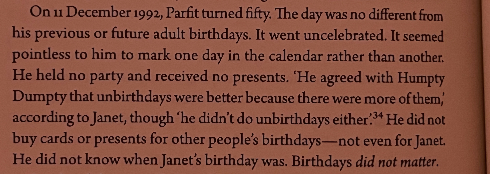

I have my idiosyncrasies. I have [aphantasia](https://en.wikipedia.org/wiki/Aphantasia). I wonder how many of my idiosyncrasies are downstream of aphantasia, given that [the condition is not well understood](https://joel-becker.com/digital-garden/aphantasia-ontology/).

Some candidates:

1. Weak recollection of auto-biographical details. (EDIT: see [section 3.4 here](https://onlinelibrary.wiley.com/doi/10.1111/mila.12432) suggesting something similar.)
2. Thinking much more clearly whilst walking than staying still.
3. Difficulty understanding the plots of films and TV shows.
   1. I once watched [Glengarry Glen Ross](https://en.wikipedia.org/wiki/Glengarry_Glen_Ross_(film)) with a group of friends, got to the end of the film, and thought it would be funny to ask whether anyone understood the story, because I found the film impossible to follow. Blank stares ensued.
4. [Limited inner-life](https://twitter.com/Mjreard/status/1765881580315201722), very little if any inner-monologue.
5. Not being able to imagine sounds, tastes, or smells.
6. Literally mouthing people's words back to them when they are describing something to me, as they are describing something to me.
7. Not doing birthdays...? 
